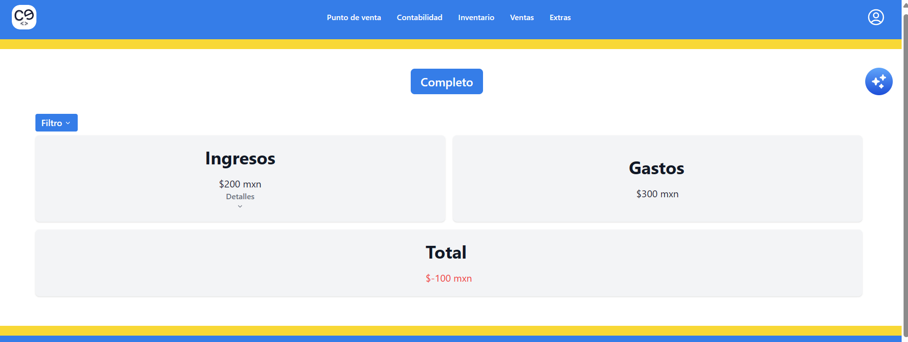
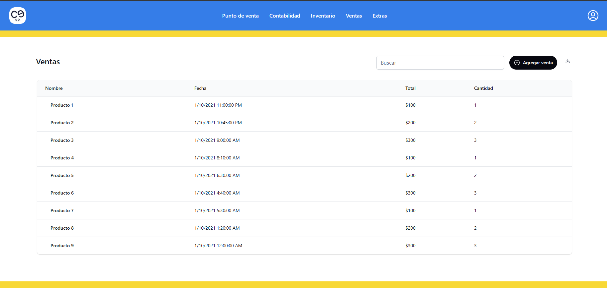
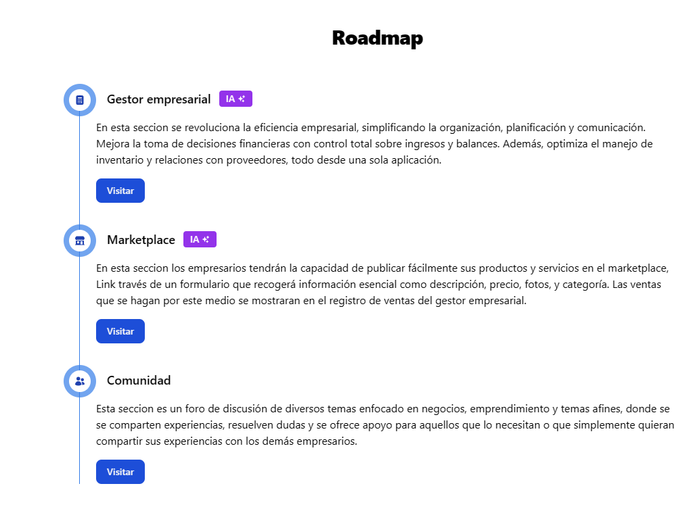

## QuickStarter

1.  Clona el repositorio

        git clone https://github.com/charlyguz/Conexion-Emprendedora.git

2.  Haz npm install

        npm install

3.  Corre el proyecto

        npm run dev

# Conexion Emprendedora

_Habla con tu empresa_

"Conexion Emprendedora" es un ecosistema integral diseñado para emprendedores y empresas de todos los tamaños, con escalabilidad incluso para grandes corporaciones. Este ecosistema ofrece una solución adaptable y de bajo costo que mejora la operatividad empresarial dando oportunidades de prosperidad y empoderamiento para las micro y pequeñas empresas.

Este es el link de nuestra pagina web
[Conexion Emprendedora](https://conexionemprendedora.z13.web.core.windows.net/)

Click [video demostrativo](https://conexionemprendedora.z13.web.core.windows.net/tutorial/gestion)

# Contenido

- [Página Principal](#página-principal)
- [RoadMap](#roadmap)
  - [Punto de venta](#punto-de-venta)
  - [Contabilidad](#contabilidad)
  - [Inventario](#inventario)
  - [Ventas](#ventas)
  - [Extras](#extras)
    - [MarketPlace](#marketplace)
    - [Comunidad](#comunidad)
    - [Mensajes](#mensajes)

## Página Principal

¿Cómo funciona? Bueno, tenemos varias secciones, pero veamos la primera vista que se nos muestra en cuanto se accede a la app.

Este espacio presenta información sobre nuestra aplicación y ofrece varias opciones para explorar su contenido, incluyendo una vista visual de algunos de sus componentes.

## RoadMap

permite darnos una vista rapida del contenido y secciones de la aplicacion

- #### Punto de venta
  El punto de venta es la piedra angular de nuestra aplicacion, ya que representa la herramienta principal para los usuarios. Con un enfoque en la esencia de la gestion de efectivo y la visualizacion como registro de los productos vendidos al momento, nuestro punto de venta ofrece un experiencia amigable y eficiente.

- #### Contabilidad

Presentamos dos versiones: una simplificada para una rápida comprensión de la salud financiera de su negocio en diferentes periodos de tiempo, y otra completa para análisis más detallados. Y cuando estés listo para crecer, nuestra versión completa, junto con los cursos de Coppel Emprende y su amigo inteligente, la guiará hacia el éxito.

- #### Inventario

Permite una administración sencilla y visual del inventario. Esta sección está diseñada para simplificar la actualización y gestión de productos, garantizando actualizaciones automáticas de cada producto dentro de tu negocio.

- #### Ventas

Esta funcionalidad proporciona una vista integral y detallada de todas las transacciones realizadas a través de nuestro punto de venta integrado, facilitando a los usuarios el monitoreo y análisis de la salud financiera de su empresa de manera eficiente.

- ### Extras

  El usuario contará con herramientas que ayudarán en su proceso de escalabilidad a través de secciones como:

  - **MarketPlace** - Nos muestra una sección en la cual puedes dar a conocer tu producto o encontrar el mejor proveedor disponible para ti.

  - **Comunidad** - A través de esta sección, se brinda apoyo al usuario donde puede realizar preguntas o responderlas con el fin de mejorar entre empresarios.

  - **Mensajes** - Esta sección muestra el correo ingresado por el usuario, además de sus mensajes y la convención.

## Colaboradores

\*[@charlyguz ](https://github.com/charlyguz) - Carlos Guzman

\*[@Tecla](https://github.com/danielctecla) - Daniel Catonga Tecla

\*[@Manuel](https://github.com/mvnueloc) - Manuel Olguin

\*[@Hariel](https://github.com/HarielPS) - Hariel Padilla
